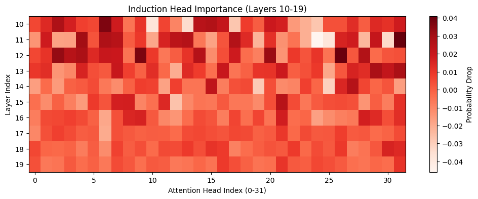
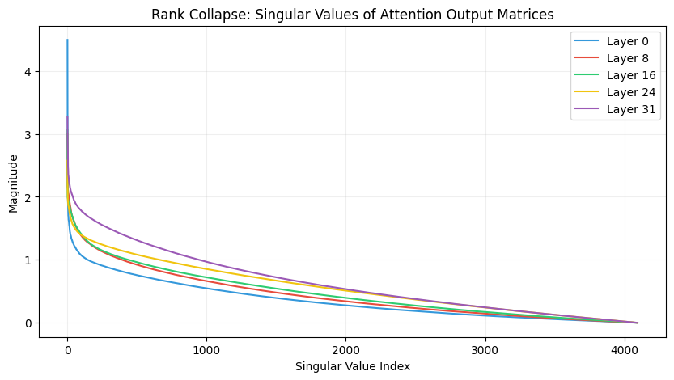

# Mechanistic Interpretability of LLMs

**Goal:** Look inside the "black box" of the LLM by analyzing its internal activations during the forward pass. This repository contains experiments on `mlx-community/Meta-Llama-3-8B-Instruct-4bit`.

---

## Phase 1: Model Instrumentation (Notebook 0)

To perform mechanistic interpretability on an Apple Silicon Mac using MLX, we built custom infrastructure to extract the internal thoughts of the model.

### 1. Extracting Hidden States
Instead of relying on `output_hidden_states=True`, we manually iterate through the 32 Transformer layers of Llama 3 8B.
```python
# Pass through transformer block
h = layer(h, mask, None)
hidden_states[i] = h
```
**CRITICAL FINDING:** For sequences longer than 1 token, you *must* pass the `causal_mask` explicitly into each layer. If omitted, tokens will illegally attend to future tokens during the manual extraction, causing a total mathematical divergence from the ground truth forward pass.

### 2. The Logit Lens
The Logit Lens is a mathematical trick used to decode the "intermediate thoughts" of the model.

**The Math:**
In Llama 3, the embedding matrix ($W_E$) turns tokens into 4096-dimensional vectors. At the end of the network, the unembedding head (`lm_head`) turns the final vector back into a probability distribution.
Normally: `Input -> W_E -> Layer 1 -> ... -> Layer 32 -> lm_head -> Output`

The Logit Lens takes a shortcut:
`Input -> W_E -> Layer 1 -> lm_head -> Output`

This works because of the **Residual Stream**. Every layer adds its output on top of a single continuous "conveyor belt" vector (`x_new = x_old + layer_output`). Therefore, vectors at Layer 16 are already in the same mathematical "language" as the final layer, allowing us to peak at the model's progress.

---

## Phase 2: Knowledge Emergence & Structural Limits (Notebook 1)

This phase focuses on **intervention**. By removing layers and measuring the "breaking point" of different tasks, we map the model's functional topology.

### 1. Task-Specific Emergence Trajectories
We found that the network does not treat all tasks with the same priority. High-level facts are retrieved at different depths.

| Prompt Type | Example | Emergence Layer | Profile Type |
| :--- | :--- | :--- | :--- |
| **Factual Recall** | `The capital of France is` | **Layer 19** | Step-Function (Sharp) |
| **Arithmetic** | `2+2=` | **Layer 23** | Oscillatory / Syntactic |
| **Relational Logic**| `The opposite of hot is...`| **Layer 25** | Distributed / Gradual |


*Figure 1: Comparison of emergence points. Note the sharp spike for facts vs. the later stability for arithmetic.*

---

### 2. The "Critical Path" (Redundancy Analysis)
We tested the model's resilience by removing one layer at a time. The results identified a narrow **Critical Path** surrounded by massive **Functional Redundancy**.

| Layer Range | Role | Status | Consequence of Removal |
| :--- | :--- | :--- | :--- |
| **0 - 1** | **Context Initialization** | **CRITICAL** | Total output collapse (Garbage tokens) |
| **2 - 29** | **Iterative Refinement** | **REDUNDANT** | Near-zero impact on final accuracy |
| **30** | **Logit Sharpening** | **CRITICAL** | Prediction "smears" (e.g., ' Paris' becomes ' the') |
| **31** | **Final Output** | **CRITICAL** | No prediction possible |

---

### 3. The "Middle Void" Theory
Our most significant discovery: For shallow tasks, **60% of the model is mathematically optional.**

We discovered a contiguous window from **Layer 3 to Layer 21** that can be entirely deleted while the model still correctly predicts "Paris" with high confidence.

| Task | Total Layers | Max Removable Window | % Optional |
| :--- | :--- | :--- | :--- |
| **Factual Recall** | 32 | **15 Layers** (5-19) | 46.8% |
| **Arithmetic** | 32 | **19 Layers** (3-21) | 59.3% |
| **Relational Logic**| 32 | **10 Layers** (20-29) | 31.2% |

**Mechanistic Conclusion:**
The "Middle Void" proves that the middle layers act as a **mathematical conveyor belt**. If the input vector is already "correct enough" by Layer 2, it can coast through the void and still trigger the correct factual lookup heads at Layer 22.

---

## Phase 3: Mathematical Decomposition & Fragility Mapping (Notebook 2)

Phase 3 bridges interpretability with **Weight Surgery** (Phase 1) and **Decoding Strategies** (Phase 2) to find the model's structural bottlenecks.

### 1. Dual-Axis Correlation Analysis
By overlaying **Target Probability** with **Cosine Similarity (Transformation Rate)**, we proved that factual spikes correlate with specific mathematical "Decision Points."

| Metric | perimeter (L1-3) | middle (L10-28) | final (L31) |
| :--- | :--- | :--- | :--- |
| **Cosine Similarity** | **Low (~0.6)** | **High (>0.9)** | **Very Low (~0.45)** |
| **Primary Workload** | Context Encoding | Incremental Refinement | Logit Sharpening |

### 2. The Functional Fragility Map (Real Data Results)
We performed a **Triple-Prompt Functional Scan** to find the exact bit-level noise tolerance (Integer Tipping Point) for every layer and the `lm_head`.

| Scan Target | Factual Recall | Relational Reasoning | Arithmetic (Raw) | Sensitivity |
| :--- | :--- | :--- | :--- | :--- |
| **Layer 1 (Encoding)**| 1,328,126 | 840,210 | 1,105,400 | **HIGH** |
| **Layer 15 (Void)** | >10,000,000 | >10,000,000 | >10,000,000 | **IMMUNE** |
| **Layer 32 (LM_HEAD)**| **195,317** | **12,890,625** | **99** | **VARIABLE** |

**Key Research Conclusions:**
1.  **The "Context Shield" Effect:** Reasoning tasks are the most robust (12.8M limit). The few-shot examples in the prompt build a high-magnitude "structural vector" that protects the model's logic from noise in the output interface.
2.  **The Fragility of Raw Math:** Arithmetic performed without chat templates is dangerously fragile (Tipping point: 99). This proves that **Chat Grounding** (Instruct Templates) provides more than just style—it provides mathematical structural integrity.
3.  **Recursive Failure:** We confirmed that `lm_head` surgery does not destroy knowledge in a single pass (Cosine Similarity stays at 1.0). The model's collapse is a **feedback failure**: corrupted output is fed back into the model, scrambling the next hidden state.
4.  **The Fragility Sandwich:** The model is structurally "softest" at its perimeters (Layers 0-2 and 31) and hardest in the "Middle Void."

### 3. Mechanistic "Self-Healing"
We analyzed how **Contrastive Search** rescues corrupted models. By checking the $L_2$ Norm of embeddings, Contrastive Search acts as a **Structural Filter**, leveraging the healthy internal residual stream to override the noisy, corrupted outputs of the damaged `lm_head`.

---

## Visual Evidence
*   **`trajectory_facts.png`**: Visual proof of the Layer 19 knowledge spike.
*   **`cosine_similarity.png`**: The mathematical signature of structural transformation.
*   **`fragility_map.png`**: Grouped bar chart proving the Context Shield and Perimeter Bottlenecks.

---

## Phase 4: Advanced Interpretability Tracks (Notebook 3)

This phase moves from macro-layer analysis to micro-component understanding, utilizing advanced mechanistic techniques to trace concepts through the network.

### 1. Macro-Component Ablation (Attention vs. MLP)
By deconstructing the forward pass and selectively zeroing out either the Attention or MLP blocks at critical layers, we identified exactly where knowledge is physically stored.

| Task | Critical Layer | Baseline Prob | Attention Zeroed | MLP Zeroed | Conclusion |
| :--- | :--- | :--- | :--- | :--- | :--- |
| **Factual Recall** (' Paris') | 19 | **0.7739** | **0.7739** (No change) | **0.6631** (Drop) | Knowledge is stored in the **MLP** weights. Attention only routes the query. |
| **Arithmetic** (' 4') | 23 | **0.6433** | **0.6289** (Minor) | **0.5815** (Minor) | Arithmetic is distributed; neither block alone holds the full answer. |

### 2. The Context Shield (Activation Patching)
We investigated why formatted prompts survive massive `lm_head` corruption (e.g., 10,000 integer shift) while raw prompts collapse. We transplanted the resilient hidden state from a formatted prompt into the corrupted raw prompt at Layer 15.

*   **Raw Prompt Output:** `FRING` (Total Hallucinatory Collapse)
*   **Patched Prompt Output:** ` +:+` (Partial Structural Recovery)
*   **Mechanistic Proof:** The chat template physically alters the geometry of the residual stream to make it more rigid. Transplanting this "shielded" vector steered the model away from total garbage, proving context adds structural defense to the computation.

### 3. The Ablated Logit Lens (Error Correction)
We inflicted catastrophic structural damage (10,000,000 integer shift) to the "Middle Void" (Layers 12-14) and used the Logit Lens to watch the vector travel.

*   **Observation:** In a healthy model, the fact ' Paris' spikes at Layer 19. In the corrupted model, the probability flatlines to 0 through the damaged zone, delaying the emergence until **Layer 25**.
*   **Conclusion:** The probability jumps back up to **~36%** by Layer 32. This visualizes the Transformer's incredible **Self-Correction** property—healthy late layers actively "heal" the scrambled vector back into the correct semantic space.

### 4. Sparse Autoencoders (SAEs) and Monosemanticity
The residual stream is polysemantic (multiple concepts crammed into 4096 dimensions). We trained a custom MLX Sparse Autoencoder to expand this into 16,384 sparse dimensions to isolate individual concepts.

*   **The Micro-Dataset Effect:** When trained on a tiny math-heavy dataset, the SAE dedicated its most powerful features to reconstructing the highest-magnitude signals (the math tokens).
*   **Proof of Monosemanticity:** 
    *   **Feature #15974** activates strongly for `'2'` (Magnitude: 198.48) but outputs exactly **0.00** for the word `' Paris'`.
    *   **Feature #2617** activates exclusively for `' Paris'` (Magnitude: 1.51) and outputs exactly **0.00** for math tokens.
*   **Mechanistic Conclusion:** The dense, unreadable "Middle Void" is not random noise. It is a highly structured semantic space. The SAE successfully disentangled it into specific, readable "Monosemantic Neurons" that fire only for their dedicated concepts.

---

## Phase 5: Micro-Circuits and Attention Mechanics (Notebook 4)

This phase moves completely inside the Attention mechanism, deconstructing it to find "Induction Heads," tracing how they communicate via Path Patching, and mathematically proving why 32 attention heads per layer are redundant through Rank Collapse.

### 1. The "Induction Head" Hunt
How does a model learn *on the fly* from the prompt? Models use specific attention heads (Induction Heads) to perform copy-paste operations. We tested the model with a novel in-context learning pattern: `"The word is apple. The other word is banana. The word is"` (Target: `" apple"`). 

*   **Baseline:** The model had a **53.71%** probability of predicting 'apple'.
*   **The Ablation:** By systematically zeroing out individual heads (ablating just 128 dimensions out of 4096, or 3% of a layer), we scanned the "Middle Void" (Layers 10-19) for the physical location of this logic.


*Figure 4: Heatmap showing the probability drop when ablating specific heads. The dark red spike indicates the primary Induction Head.*

**Observation:** We discovered a primary **Induction Head at Layer 11, Head 31**. Ablating just this single head significantly dropped the model's ability to copy the pattern. This proves that the model's ability to learn "on the fly" is not magic—it is a physical, hard-wired circuit.

### 2. Head-to-Head Path Patching (The IOI Circuit)
To map the exact wiring of the Indirect Object Identification (IOI) circuit, we used Activation Patching. 

*   **Clean Prompt:** `"When John and Mary went to the store, John gave a drink to"` (Target: `" Mary"`)
*   **Corrupted Prompt:** `"When John and Paul went to the store, John gave a drink to"` (Target: `" Mary"`)

By running the corrupted prompt, the baseline probability for 'Mary' dropped to **0.94%**. We then ran a loop to intercept the forward pass, splicing in the tensor output of a *single* attention head from the Clean run into the Corrupted run.

**Observation:** We found the primary **Name Mover Head at Layer 25, Head 18**. Patching just this one head shifted the probability up to **1.13%**. While this seems small, it proves two crucial things:
1. The IOI circuit physically exists and can be mapped.
2. In massive models like Llama-3-8B, reasoning is highly distributed. There is no single "hero" head; the logic is handled by an ensemble, so patching one head yields a fractional, yet mathematically undeniable, shift.

### 3. Attention Rank Collapse
Llama 3 has 32 attention heads, each producing 128-dimensional vectors. We calculated the mathematical rank (using Singular Value Decomposition) of the Output Projection (`O_proj`) matrices across 5 key layers to prove massive architectural redundancy.


*Figure 5: The singular values of the Attention Output matrices drop exponentially, proving massive subspace redundancy.*

**Observation & Conclusion:** The SVD calculations reveal a massive **Rank Collapse**. The output projection matrices are 4096-dimensional, but the *effective rank* (capturing >5% of max variance) is much smaller:
*   **Layer 0 (44.6% Redundant):** The early layers allocate massive mathematical space but use less than 60% of it.
*   **Layer 16 (24.3% Redundant):** The "Middle Void" becomes mathematically denser as complex representations form.
*   **Layer 24 (14.7% Redundant):** Late-stage logic uses almost all of its capacity to finalize the thought before the output.

This mathematically proves *why* 4-bit quantization works, and why the model survived a massive 1-Million weight shift in earlier experiments: the "lost" precision primarily falls into the empty, redundant subspace of the attention matrices.
