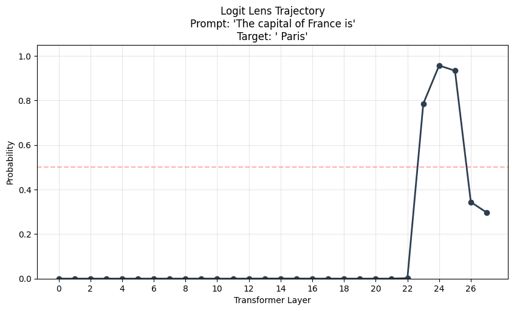
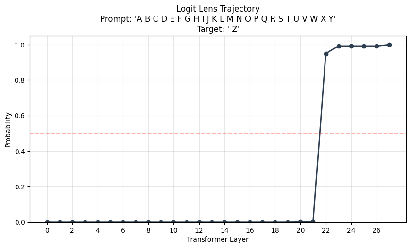

# Mechanistic Interpretability of LLMs

**Goal:** Look inside the "black box" of the LLM by analyzing its internal activations during the forward pass. This repository contains experiments on `mlx-community/Qwen2.5-1.5B-Instruct-bf16`.

## Phase 1: Model Instrumentation (Notebook 0)

To perform mechanistic interpretability on an Apple Silicon Mac using MLX, we must first build custom infrastructure to extract the internal thoughts of the model. MLX's compiled C++ backends do not natively expose intermediate variables like Hugging Face does.

### 1. Extracting Hidden States
Instead of relying on `output_hidden_states=True`, we manually iterate through the 28 Transformer layers of Qwen 1.5B.
```python
# Pass through transformer block
h = layer(h, mask, None)
hidden_states[i] = h
```
**CRITICAL FINDING:** For sequences longer than 1 token, you *must* pass the `causal_mask` explicitly into each layer. If omitted, tokens will illegally attend to future tokens during the manual extraction, causing massive mathematical divergence from the ground truth forward pass.

### 2. The Logit Lens
The Logit Lens is a mathematical trick to decode the "intermediate thoughts" of the model.

**The Math:**
In a Transformer, the embedding matrix ($W_E$) takes words and turns them into 1536-dimensional vectors. At the very end of the model, the unembedding matrix ($W_U$ or `lm_head`) takes the final vector and turns it back into a probability distribution over the 151,936 vocabulary words.
Normally: `Input -> W_E -> Layer 1 -> ... -> Layer 28 -> W_U -> Output`

The Logit Lens takes a shortcut:
`Input -> W_E -> Layer 1 -> W_U -> Output`

This works because of the **Residual Stream**. Every layer adds its output on top of a single continuous conveyor belt vector (`x_new = x_old + layer_output`). Therefore, vectors at layer 14 are already in the same mathematical "language" as the final layer!

**Implementation Note:** Qwen 2.5 uses tied word embeddings. In MLX, applying the tied embedding requires `model.model.embed_tokens.as_linear()`, not a standard `.weight.T` matrix multiplication, to maintain exact mathematical precision (0.0000 discrepancy).

### 3. Visualizing Attention Matrices
We implemented a monkey-patch context manager for `mlx.nn.MultiHeadAttention.__call__` to intercept the raw matchmaking scores.

**The Math of Attention:**
$$ \text{Attention}(Q, K, V) = \text{softmax}\left(\frac{Q K^T}{\sqrt{d_k}} + M\right) V $$
* **Query ($Q$)**: The current token broadcasting "Here is what I am looking for."
* **Key ($K$)**: Every past token broadcasting "Here is what I am."
* **Dot Product ($Q \cdot K$)**: A Match Score. When the "what I'm looking for" vector lines up with the "what I am" vector of a past token, the dot product explodes into a high number.
* **Softmax**: Turns raw match scores into a clean percentage breakdown (e.g., 95% on Token A, 5% on Token B).

**We intercept the matrix immediately after the Softmax step.** This gives us a raw percentage grid showing exactly *how the model is distributing its attention* before it actually moves the data (the $V$ step).

#### Example: Layer 0, Head 4 Attention Heatmap
*(Prompt: "The boy ran fast because he")*


* Notice the upper right triangle is completely white due to the causal mask (tokens cannot look into the future).
* Dark blue squares indicate where Head 4 is putting its contextual focus!

## Phase 2: Core Interpretability Techniques (Notebook 1)

While Phase 1 built the x-ray machine, Phase 2 actually uses it to look at the bones of the network. We specifically use the **Logit Lens** to track the probability of a specific word across all 28 layers of the model.

### Factual Knowledge Emergence
Language models do not "know" facts from Layer 1. The early layers are dedicated to processing syntax and grammar. Factual knowledge is injected into the residual stream by specific Attention/MLP heads in the middle-to-late layers.

When we run the prompt `"The capital of France is"` and track the exact probability of the token `" Paris"` across all 28 layers, we see a **step-function emergence**:



* From Layer 0 to Layer 22, the model has virtually 0% confidence. It predicts syntax tokens like `" a"`, `" the"`, and `" located"`.
* **At Layer 23 exactly**, an attention/MLP mechanism fires, injecting the factual look-up of "Paris -> France" into the residual stream. Confidence spikes from ~1% to 78% instantly.

### Syntactic & Format Emergence
By contrast, strict pattern-matching and grammatical formatting decisions are processed differently. If we trace a simple alphabetical sequence prompt `"A B C D E F G H I J K L M N O P Q R S T U V W X Y"` and track the token `" Z"`, we see a smoother, earlier emergence profile:



