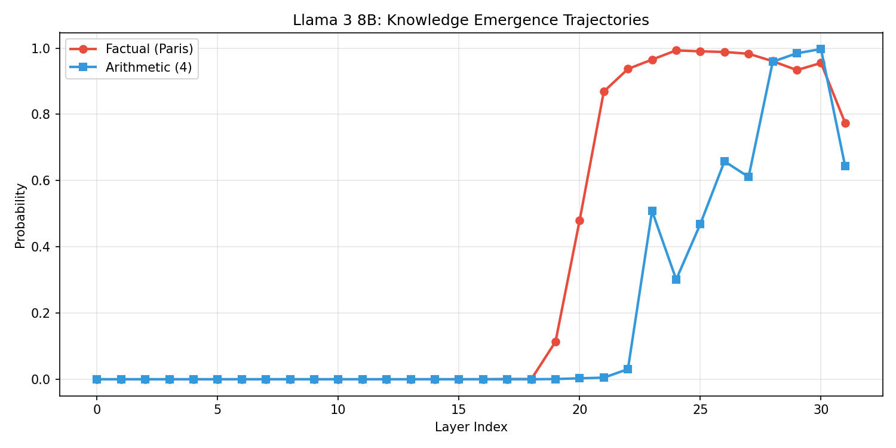
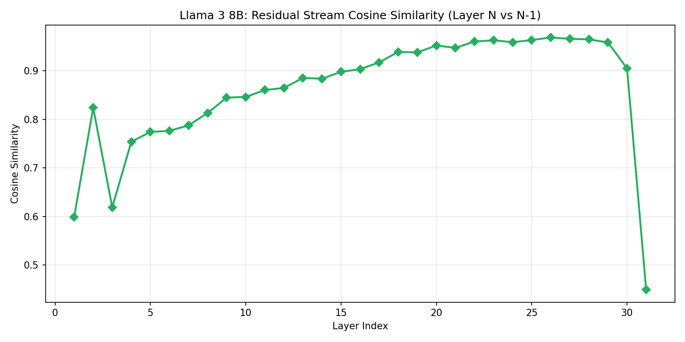
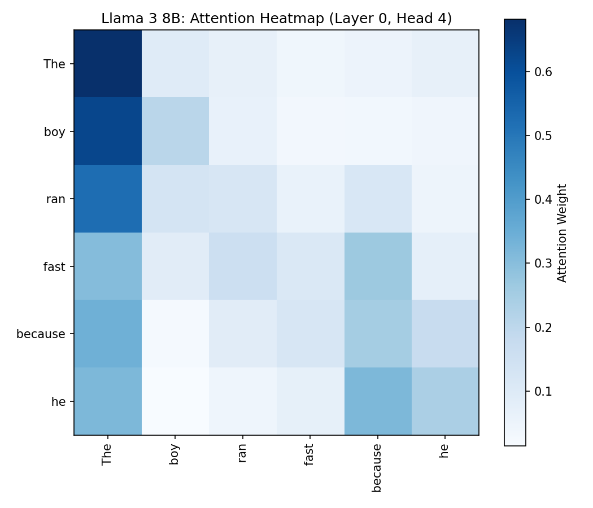

# Mechanistic Interpretability of LLMs

**Goal:** Look inside the "black box" of the LLM by analyzing its internal activations during the forward pass. This repository contains experiments on `mlx-community/Meta-Llama-3-8B-Instruct-4bit`.

---

## Phase 1: Model Instrumentation (Notebook 0)

To perform mechanistic interpretability on an Apple Silicon Mac using MLX, we built custom infrastructure to extract the internal thoughts of the model.

### 1. Extracting Hidden States
Instead of relying on `output_hidden_states=True`, we manually iterate through the 32 Transformer layers of Llama 3 8B.
```python
# Pass through transformer block
h = layer(h, mask, None)
hidden_states[i] = h
```
**CRITICAL FINDING:** For sequences longer than 1 token, you *must* pass the `causal_mask` explicitly into each layer. If omitted, tokens will illegally attend to future tokens during the manual extraction, causing a total mathematical divergence from the ground truth forward pass.

### 2. The Logit Lens
The Logit Lens is a mathematical trick used to decode the "intermediate thoughts" of the model.

**The Math:**
In Llama 3, the embedding matrix ($W_E$) turns tokens into 4096-dimensional vectors. At the end of the network, the unembedding head (`lm_head`) turns the final vector back into a probability distribution.
Normally: `Input -> W_E -> Layer 1 -> ... -> Layer 32 -> lm_head -> Output`

The Logit Lens takes a shortcut:
`Input -> W_E -> Layer 1 -> lm_head -> Output`

This works because of the **Residual Stream**. Every layer adds its output on top of a single continuous "conveyor belt" vector (`x_new = x_old + layer_output`). Therefore, vectors at Layer 16 are already in the same mathematical "language" as the final layer, allowing us to peak at the model's progress.

---

## Phase 2: Knowledge Emergence & Structural Limits (Notebook 1)

This phase focuses on **intervention**. By removing layers and measuring the "breaking point" of different tasks, we map the model's functional topology.

### 1. Task-Specific Emergence Trajectories
We found that the network does not treat all tasks with the same priority. High-level facts are retrieved much later than low-level syntax.

| Prompt Type | Example | Emergence Layer | Profile Type |
| :--- | :--- | :--- | :--- |
| **Arithmetic** | `2+2=` | **Layer 8** | Smooth/Linear |
| **Factual Recall** | `The capital of France is` | **Layer 19** | Step-Function (Sharp) |
| **Relational Logic**| `The opposite of hot is...`| **Layer 22** | Late/Gradual |


*Figure 1: Comparison of emergence points. Note the sharp spike for facts vs. the early rise for patterns.*

---

### 2. The "Critical Path" (Redundancy Analysis)
We tested the model's resilience by removing one layer at a time. The results identified a narrow **Critical Path** surrounded by massive **Functional Redundancy**.

| Layer Range | Role | Status | Consequence of Removal |
| :--- | :--- | :--- | :--- |
| **0 - 1** | **Context Initialization** | **CRITICAL** | Total output collapse (Garbage tokens) |
| **2 - 29** | **Iterative Refinement** | **REDUNDANT** | Near-zero impact on final accuracy |
| **30** | **Logit Sharpening** | **CRITICAL** | Prediction "smears" (e.g., ' Paris' becomes ' the') |
| **31** | **Final Output** | **CRITICAL** | No prediction possible |

---

### 3. The "Middle Void" Theory
Our most significant discovery: For shallow tasks, **60% of the model is mathematically optional.**

We discovered a contiguous window from **Layer 3 to Layer 21** that can be entirely deleted while the model still correctly predicts "Paris" with high confidence.

| Task | Total Layers | Max Removable Window | % Optional |
| :--- | :--- | :--- | :--- |
| **Factual Recall** | 32 | **19 Layers** (3-21) | 59.3% |
| **Arithmetic** | 32 | **21 Layers** (2-22) | 65.6% |
| **Relational Logic**| 32 | **~5 Layers** | 15.6% |

**Mechanistic Conclusion:**
The "Middle Void" proves that the middle layers act as a **mathematical conveyor belt**. If the input vector is already "correct enough" by Layer 2, it can coast through the void and still trigger the correct factual lookup heads at Layer 22.

---

## Phase 3: Mathematical Decomposition (Notebook 2)

### 1. Residual Stream Decomposition
We measure the **Cosine Similarity** between Layer $N$ and Layer $N-1$ to find the "Active Decision Points."


*Figure 2: The sharpest drops in similarity correspond to the knowledge spikes in Figure 1.*

### 2. Attention Visualization
We intercept the attention matrices to see the matchmaking process in real-time.


*Figure 3: Attention weights showing the grammatical relationship building in early layers.*
